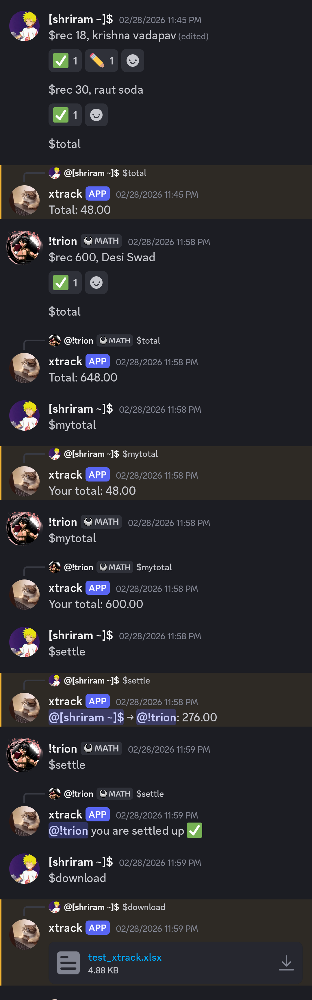

# xtrack

Tired of the awkward "wait, who paid for what?" conversation after every group trip, dinner,
or shared subscription? **xtrack** takes care of it for you — right inside Discord, 
where your group already hangs out.

---

## How It Works

Each person records what they paid using a simple command. xtrack keeps a running log 
per channel, so every group can have its own expense thread — one channel for the 
trip to Goa, another for the flat's monthly bills, another for your weekly lunch crew.

When it's time to settle up, xtrack figures out the **minimum number of transactions** 
needed so everyone is square. No spreadsheets, no Splitwise, no switching apps.

---

## Commands

| Command | What it does |
|---|---|
| `$rec <amount>, <note>` | Record an expense (`$rec 850, pizza night`) |
| `$total` | See the total spent in this channel |
| `$mytotal` | See how much *you've* spent in this channel |
| `$settle` | Calculate exactly who owes whom and how much |
| `$download` | Export all expenses to an Excel spreadsheet |

**Made a mistake?** Just edit your `$rec` message — xtrack will update the record 
automatically. Delete the message and the expense disappears too.

---

## Settling Up

Run `$settle` to see exactly what **you** owe and to whom. xtrack calculates the fairest
way to balance the group and shows only your share of the dues — no noise, just what's
relevant to you.

Already square? You'll get a friendly ✅ confirmation instead.

**Example output:**
```
@You → @Arjun: 450.00
```

---

## Excel Export

Run `$download` in any channel to get a full `.xlsx` spreadsheet of every expense — 
timestamped, with usernames and notes. Handy for reimbursements, record-keeping, 
or settling with people outside the server.

DM xtrack directly and use `$download` to get a spreadsheet of all your personal 
expenses across every channel.

---

## Why xtrack?

- ✅ **No account needed** — works with your existing Discord account
- ✅ **Per-channel tracking** — keep different groups and trips separate
- ✅ **Non-destructive edits** — edit or delete messages to correct mistakes
- ✅ **Minimal permissions** — only needs to read and send messages
- ✅ **Instant settlements** — no waiting, no syncing, no external app

---

*Built for friend groups, roommates, travel crews, and anyone who's ever had to 
figure out who owes who after a group dinner.*

---

